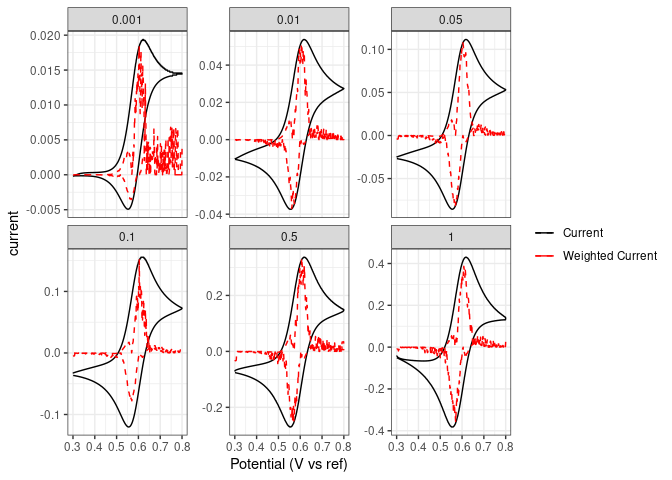
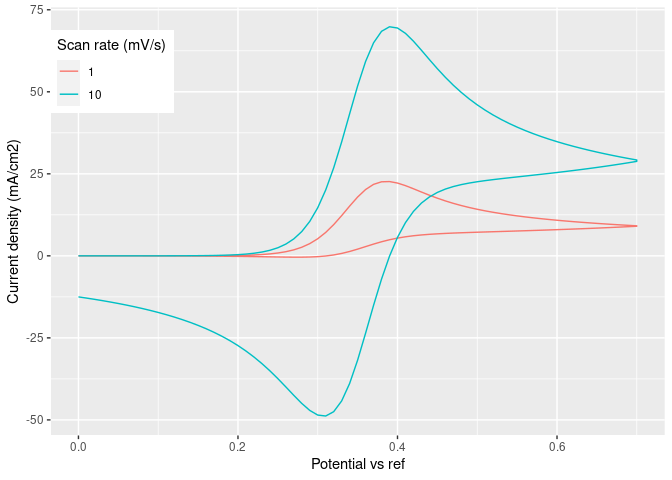
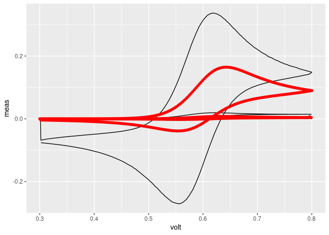
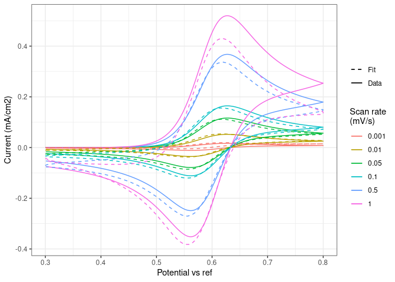

Cyclic voltammetry simulation and fitting algorithm

Derived from Peter Attia’s MatLab code:
<https://petermattia.com/cyclic_voltammetry_simulation/simulation.html>
\* update from September 20, 2020

Changes from the original code: \* Adapted from MatLab to R \* Runs the
CV for 3 cycles to more closely resemble experimental conditions. Fits
to the 3rd cycle \* Use of the simulation as an objective function to
fit to experimental data \* Separate diffusion coefficients for oxidized
and reduced species. Holding the spatial discretization step constant.
\* Includes reaction for decomposition of oxidized species

# Installation setup

You only need to run this section once to download the packages. After
that, you can comment it out with \# symbols.

``` r
# Installing packages - you only need to do this once
#install.packages("dplyr") # Data frame processing
#install.packages("ggplot2") # Plotting
#install.packages("GA") # Genetic algorithm optimization
#install.packages("parallel") # Paralell processing
```

# Code setup

Clears the workspace so there aren’t any floating variables. Loads the
necessary packages.

I have found that sometimes RStudio crashes if I load packages from
here. It runs properly if you copy the lines with library() and run them
in the console directly instead.

``` r
# Clear workspace and setup necessary libraries

# Last update:
date()
```

    ## [1] "Thu May 13 10:05:42 2021"

``` r
# Clear work space
rm(list = ls())

library(dplyr) # Data frame processing
```

    ## 
    ## Attaching package: 'dplyr'

    ## The following objects are masked from 'package:stats':
    ## 
    ##     filter, lag

    ## The following objects are masked from 'package:base':
    ## 
    ##     intersect, setdiff, setequal, union

``` r
library(patchwork) # Subplotting
library(GA) # Genetic algorithm optimization
```

    ## Loading required package: foreach

    ## Loading required package: iterators

    ## Package 'GA' version 3.2
    ## Type 'citation("GA")' for citing this R package in publications.

    ## 
    ## Attaching package: 'GA'

    ## The following object is masked from 'package:utils':
    ## 
    ##     de

``` r
library(parallel) # Paralell processing
library(ggplot2)
```

# Load Data

R has automatic support for .csv files, but not .xls or .xlsx. For
simplicity, this code assumed .csv files. The test data is formatted as:
\* Column 1: working electrode potential, evenly spaced \* Column 2:
voltammogram current of only the background electrolyte \* Column 3:
voltammogram current of the redox species \* Column 4: difference
between the voltammogram of the redox species and that of the
electrolyte, i.e. the current attributed solely to the Faradaic
reactions \* Columns 5+: repeat of 2\~4 with other scan rates

This script is written assuming that all of the data comes from the same
solution composition, but at different scan rates.

The regression function uses the weighted sum of squares error as the
objective function to minimize. The weights in this function are the
normalized current multiplied by the normalized magnitude of the second
derivative of the current. Normalizing the current allows comparison of
different scan rates without over-emphasizing the quality of fit of
higher scan rates due to higher current magnitudes. The second
derivative of the current (with respect to voltage) describes the
curvature of the CV at the given point. The second derivative is highest
when the curvature is highest, which aligns with qualitative assessments
of CVs, which emphasize the peaks.

``` r
# Concentration of redox species
concentration = 1e-3 # mol/L

# Load data
file = "TEMPO_1mM_20wtNaPTS.csv"
CV.data = read.csv(file, header = TRUE)
# Filter down to only the background-subtracted data: first column is the potential; every 3rd is the background subtracted current
CV.data = CV.data[,seq(from = 1, to = length(names(CV.data)), by = 3)]
# Extract the scan rates from the header names; units of mV/s
scanrate = unlist(strsplit(names(CV.data), "mvs"))[c(FALSE, TRUE)]
scanrate = as.numeric(unlist(strsplit(scanrate, "X"))[c(FALSE, TRUE)])*1e-3

# Combine all scans into a single column vector. For each scan rate, calculate the regression weighting factor (numerical 2nd derivative)
data = data.frame()
for(i in 1:length(scanrate)){
  # Temporary variable to calculate the 2nd derivative in
  temp = data.frame(voltage = CV.data$E, current = CV.data[,i+1], scanrate = scanrate[i])
  # Use a moving polynomial fit of 15 point window; end points are the same as the first point
  len = length(temp$current); der2 = rep(NA, 7)
  for(n in 7:(len-6)){
    fit = lm(current ~ I(voltage^2) + I(voltage), data = temp[c((n-7):(n+7)),])
    der2[n] = unname(fit$coefficients[2])
  }
  # Fill end points with neighbor points
  der2[1:7] = der2[7]
  der2[length(der2):len] = der2[length(der2)]
  # Find points where the scan rate flips; replace those as well with neighbor points
  temp$dir = sign(c(temp$voltage[2] -   temp$voltage[1], temp$voltage[2:nrow(temp)] -   temp$voltage[1:(nrow(temp)-1)]))
  pos = which(temp$dir != temp$dir[1])
  der2[(min(pos)-7):(min(pos)-1)] = der2[(min(pos)-8)]
  der2[min(pos):(min(pos)+6)] = der2[min(pos)+7]
  
  temp$weight1 = abs(der2)/max(abs(der2)) # Normalize and absolute value - equally weight concave up/down; de-emphasize flatter regions
  temp$weight2 = 1/max(abs(temp$current)) # Additional weighting factor by the inverse of the current - so different scan rates are equally emphasized
  
  data = rbind(data, temp)
}
CV.data = data
# Normalize the secondary weight
CV.data$weight2 = CV.data$weight2/max(CV.data$weight2)
# Convert units: current needs to be mA/cm2. Assuming a 3mm diameter disc electrode
CV.data$current = CV.data$current*1e3/(pi*(0.3)^2/4)

# Check that the CVs are all collected properly
ggplot(CV.data) +
  geom_path(mapping = aes(x = voltage, y = current, color = "unweight"), linetype = 1) +
  geom_path(mapping = aes(x = voltage, y = weight1*current, color = "weight"), linetype = 2) +
  facet_wrap(~scanrate, scale = "free_y") + 
  scale_color_manual(labels = c("unweight" = "Current", "weight" = "Weighted Current"), name = "", 
                     values = c("unweight" = "black", "weight" = "red"), breaks = c("unweight", "weight")) +
  labs(x = "Potential (V vs ref)", color = "") +
  theme_bw() + 
rm(file, data, temp, der2, fit, i, n, len, scanrate)
```



``` r
# Trim the data for fitting. The lower resolution speeds up the code for this illustration.
CV.data.trim = CV.data[c(TRUE, rep(FALSE, 2)), ] # Every 3rd point
```

# Simulation function

This creates the function that runs the CV simulations, and outputs an
example to show that it works.

``` r
# Functional form of the simulation with identical spatial resolution
CV.simulation = function(DR, DO, alpha, k0, E0, C, voltage.range, v, km){
  # Default Fitting variables
  # DR     = 1E-5;   # [=] cm^2/s, R diffusion coefficient. Default = 1E-5
  # DO     = 1E-5;   # [=] cm^2/s, O diffusion coefficient. Default = 1E-5
  # alpha  = 0.5;    # [=] dimensionless charge-transfer coefficient. Default = 0.5
  # k0     = 1E-2;   # [=] cm/s, electrochemical rate constant. Default = 1E-2
  # E0     = 0       # [=] V, standard reduction potential
  # voltage.range    # [=] V, voltages measured
  
  # Experimental conditions
  # C      = 1.0;         # [=] mol/L, initial concentration of O. Default = 1.0
  C      = C / 1000;    # Convert C from mol/L to mol/cm3
  # v      = 1E-3;        # [=] V/s, sweep rate. Default = 1E-3
  n      = 1.0;         # [=] number of electrons transfered. Default = 1
  T      = 298.15;      # [=] K, temperature. Default = 298.15
  
  # Physical constants
  F      = 96485;   # [=] C/mol, Faraday's constant
  R      = 8.3145;  # [=] J/mol-K, ideal gas constant
  f      = F/(R*T); # [=] 1/V, normalized Faraday's constant at room temperature
  
  # Simlation variables
  L      = length(voltage.range);    # [=] number of iterations per t_k (pg 790). Default = 500
  DMr     = 0.45;   # [=] model diffusion coefficient (pg 788). Default = 0.45
  DMo     = DMr*DO/DR;   # [=] model diffusion coefficient (pg 788). Default = 0.45
  if(DMo > 0.45){
    DMo = 0.45
    DMr = DMo*DR/DO
  }
  
  # Derived variables
  Dt  = c(0, abs(voltage.range[2:L] - voltage.range[1:(L-1)])/v ) # Time change from previous point
  # Issues with Dt = 0; replace with the nearest nonzero value
  while(length(which(Dt == 0)) > 0){
    pos = which(Dt == 0)
    Dt[pos] = Dt[pos+1]
  }
  DRx = sqrt(DR*Dt/DMr);     # [=] cm, delta x (Eqn B.1.13, pg 791)
  DOx = sqrt(DO*Dt/DMo);     # [=] cm, delta x (Eqn B.1.13, pg 791)
  j   = ceiling(4.2*L^0.5)+5;  # number of boxes (pg 792-793). If L~200, j=65
  
  # Initial setup
  # k = 0:L;                # time index vector
  eta = voltage.range - E0; # overpotential scan, both directions
  Enorm = eta*f;          # normalized overpotential
  kf = k0*exp(  -alpha *n*Enorm); # [=] cm/s, fwd rate constant (pg 799)
  kb = k0*exp((1-alpha)*n*Enorm); # [=] cm/s, rev rate constant (pg 799)
  
  # Concentration matrices
  if(voltage.range[1] < voltage.range[2]){ # If initial scan is negative, then starting with only oxidized species
    O = matrix(rep(0, (L+1)*j), nrow = L+1) # [=] mol/cm^3, concentration of O
    R = matrix(rep(C, (L+1)*j), nrow = L+1)  # [=] mol/cm^3, concentration of R
    J0 = rep(0, L+1) # [=] mol/cm^2-s, flux of O at the surface
  } else{ # Starting reduced if the opposite is true
    O = matrix(rep(C, (L+1)*j), nrow = L+1) # [=] mol/cm^3, concentration of O
    R = matrix(rep(0, (L+1)*j), nrow = L+1)  # [=] mol/cm^3, concentration of R
    J0 = rep(0, L+1) # [=] mol/cm^2-s, flux of O at the surface
  }
  
  # Simulation loop: 3 cycles
  for(loop in 1:3){
    for(i1 in 1:L){ # Time index
      # Update bulk concentrations of O and R
      for(i2 in 2:(j-1)){ # Space index
        O[i1+1, i2] = O[i1, i2] + DMo*(O[i1, i2+1] + O[i1, i2-1] - 2*O[i1, i2]) - km*O[i1,i2] # Discretized diffusion with reaction loss
        R[i1+1, i2] = R[i1, i2] + DMr*(R[i1, i2+1] + R[i1, i2-1] - 2*R[i1, i2])               # Discretized diffusion only
      }
      
      # Update flux at the surface based on reaction kinetics
      # J0[i1+1] = ( kf[i1+1]*O[i1+1, 2] ) / (1 + DOx[i1]/DO * (kf[i1+1] + kb[i1+1])) - kb[i1+1]*R[i1+1,2] / (1 + DRx[i1]/DR * (kf[i1+1] + kb[i1+1]))
      J0[i1+1] = ( kf[i1+1]*O[i1+1, 2]  - kb[i1+1]*R[i1+1,2]) / (1 + DRx[i1]/DR * kb[i1+1] + DOx[i1]/DO * kf[i1+1] )
      
      # Update surface concentrations
      O[i1+1, 1] = O[i1+1, 2] - J0[i1+1]*(DOx[i1]/DO) - km*O[i1,1]
      R[i1+1, 1] = R[i1+1, 2] + J0[i1+1]*(DRx[i1]/DR)
    }
    # Save the current output
    # Z[,loop]  = -n*F*J0 * 1000; # [=] A/cm^2 -> mA/cm^2, current density
    # Final time point is the first of the next cycle
    # O[1,] = O[L,]; R[1,] = R[L,]; J0[1] = J0[L]
  }
  
  # Only interested in the current for the 3rd cycle
  Z  = -n*F*J0 * 1000; # [=] A/cm^2 -> mA/cm^2, current density
  # Some issues with lengths not lining up due to discretization
  while(length(eta) > length(Z)){
    eta = eta[1:(length(eta)-1)];
  }
  while(length(Z) > length(eta)){
    Z = Z[1:(length(Z)-1)];
  }
  CV.sim = data.frame(voltage = eta + E0, current = Z, scanrate = v)
}

test = rbind(CV.simulation(DR = 1e-5, DO = 1e-5, alpha = 0.35, k0 = 0.01, E0 = 0.35, C = 1, 
                           voltage.range = c(seq(from = 0, to = 0.7, by = 0.01), seq(from = 0.7, to = 0, by = -0.01)), v = 0.001, km = 1e-1), 
             CV.simulation(DR = 1e-5, DO = 1e-5, alpha = 0.35, k0 = 0.01, E0 = 0.35, C = 1, 
                           voltage.range = c(seq(from = 0, to = 0.7, by = 0.01), seq(from = 0.7, to = 0, by = -0.01)), v = 0.01, km = 1e-5))
ggplot(test) +
  geom_path(mapping = aes(x = voltage, y = current, color = as.factor(scanrate*1e3))) +
  labs(x = "Potential vs ref", y = "Current density (mA/cm2)", color = "Scan rate (mV/s)") + theme(legend.position = c(0.1, 0.85))
```



# Fitting function

Create the function that simulates the same conditions as the CV
experiment (i.e. same voltage points as the data) with a guess for the
variables of interest. \* DR : Diffusion coefficient of the reduced
species (cm2/s) \* DO : Diffusion coefficient of the oxidized species
(cm2/s) \* alpha : charge transfer coefficient (unitless) \* k0 :
electrochemical rate constant (cm/s) \* E0 : standard reduction
potential (V vs reference)

DR, DO, and k0 are fit in log10 units This gives better resolution when
spanning over multiple orders of magnitude.

Section will output a CV with an estimated guess of the parameters and
plot compared to the data.

``` r
# Set up the function for the regression analysis
CV.fit.function = function(voltage, scanrate, logDR, logDO, alpha, logk0, E0, C, logkm){
  # Input of the data point voltages, scan rates, and known concentration
  # Initial guesses for the DR, DO, alpha, k0, and E0
  # DR, DO, and k0 are log units for ease of convergence
  DR = 10^logDR; DO = 10^logDO; k0 = 10^logk0; km = 10^logkm
  # Will output the predicted current
  current.out = c()
  # For each unique scan rate, run the simulation separately
  for(v in unique(scanrate)){
    # Extract the voltage from that scan rate
    volt.range = voltage[scanrate == v]
    # Run the simulation
    CV.sim = CV.simulation(DR = DR, DO = DO, alpha = alpha, k0 = k0, E0 = E0, C = C, voltage.range = volt.range, v = v, km = km)
    # Combine and save
    current.out = c(current.out, CV.sim$current)
  }

  return(current.out)
}

# Initial guesses for the fitting variables
DR.guess = 1e-6 # cm2/s
DO.guess = 1e-6 # cm2/s
alpha.guess = 0.5
k0.guess = 1e-2 # cm/s
E0.guess = 0.6
km.guess = 1e-2
# voltage = CV.data$voltage
scanrate = CV.data$scanrate

test.data = filter(CV.data.trim, scanrate == unique(scanrate)[1] | scanrate == unique(scanrate)[5])

test.current = CV.fit.function(voltage = test.data$voltage, scanrate = test.data$scanrate,
                               logDR = log10(DR.guess), logDO = log10(DO.guess), alpha = alpha.guess, logk0 = log10(k0.guess), E0 = E0.guess, 
                               C = concentration, logkm = log10(km.guess))

# Check that CVs came out similar to the results
ggplot(data.frame(volt = test.data$voltage, meas = test.data$current, sim = test.current)) +
  geom_path(mapping = aes(x = volt, y = meas), color = "black") +
  geom_path(mapping = aes(x = volt, y = sim), color = "red") +
  geom_point(mapping = aes(x = volt, y = sim), color = "red")
```



# Fitting: Weighted Sum of Squares Regression

This method uses the sum of squares regression, weighted by the absolute
value of the local 2nd derivative of the data. The best fit is found
using a genetic algorithm with a population of 50, up to 50 generations.
Convergence happens when the best-case scenario does not change for 10
generations. These GA parameters can be tuned as needed. Generally
larger populations and logner runs give more robust and reproducible
results.

Each variable has its own lower and upper bounds that can be tuned based
on what you predict. Tuning these ranges can improve the speed (making
it narrower around your guess), but doing so can result in overfitting.

When changing the ranges, remember that DR, DO, and k0 are given as
their log10.

The current implementation uses parallel processing with 2 cores to
speed up the calculation. It takes \~15 minutes to do a full fit of 50
generations.

The function will output every generation’s mean and best because I have
monitor = TRUE. I find this helpful to track that it is actually
running.

``` r
# Try genetic algorithm with test data, timing it to see how long it takes
#install.packages("doParallel")
library(doParallel)
system.time({
  mod.GA <- ga(type = "real-valued",
               # Fitness function: weighted sum of squares of error
               fitness =  function(var){-sum((CV.data.trim$current - (CV.fit.function(voltage = CV.data.trim$voltage, scanrate = CV.data.trim$scanrate, 
                                  # Fit variables and concentration C
                                  logDR = var[1], logDO = var[2], alpha = var[3], logk0 = var[4], E0 = var[5], C = concentration, logkm = var[6])))^2*
                                  CV.data.trim$weight1*CV.data.trim$weight2)},
               # Bounds for each of the varaibles
               lower = c(-6, -6, 0.45, -1, 0.55, -9), upper = c(-5, -5, 0.55, 1, 0.65, -1), 
               # Genetic algorithm parameters: population, iteration, and run size (how guesses per group, how many groups)
               # will output up to <maxiter> times, but will stop early if the best fit stays the same for <run> iterations
               popSize = 50, maxiter = 50, run = 10, monitor = TRUE,
               # Parallel computing with 2 cores - speeds up calculation time
               parallel = 2)
})
```

    ## GA | iter = 1 | Mean = -0.12340725 | Best = -0.01904161
    ## GA | iter = 2 | Mean = -0.07768364 | Best = -0.01759614
    ## GA | iter = 3 | Mean = -0.03797852 | Best = -0.01501607
    ## GA | iter = 4 | Mean = -0.02641672 | Best = -0.01344291
    ## GA | iter = 5 | Mean = -0.01924961 | Best = -0.01344291
    ## GA | iter = 6 | Mean = -0.02064717 | Best = -0.01344291
    ## GA | iter = 7 | Mean = -0.01562762 | Best = -0.01344291
    ## GA | iter = 8 | Mean = -0.02011843 | Best = -0.01332429
    ## GA | iter = 9 | Mean = -0.01868466 | Best = -0.01332429
    ## GA | iter = 10 | Mean = -0.01657215 | Best = -0.01332429
    ## GA | iter = 11 | Mean = -0.01751797 | Best = -0.01332429
    ## GA | iter = 12 | Mean = -0.01668152 | Best = -0.01325932
    ## GA | iter = 13 | Mean = -0.01477796 | Best = -0.01325932
    ## GA | iter = 14 | Mean = -0.01905906 | Best = -0.01325932
    ## GA | iter = 15 | Mean = -0.01449040 | Best = -0.01325932
    ## GA | iter = 16 | Mean = -0.01506498 | Best = -0.01325932
    ## GA | iter = 17 | Mean = -0.01356539 | Best = -0.01325932
    ## GA | iter = 18 | Mean = -0.01406189 | Best = -0.01323459
    ## GA | iter = 19 | Mean = -0.01523406 | Best = -0.01323446
    ## GA | iter = 20 | Mean = -0.01378641 | Best = -0.01323446
    ## GA | iter = 21 | Mean = -0.01485041 | Best = -0.01323097
    ## GA | iter = 22 | Mean = -0.01469119 | Best = -0.01323097
    ## GA | iter = 23 | Mean = -0.01412979 | Best = -0.01323097
    ## GA | iter = 24 | Mean = -0.01376463 | Best = -0.01323097
    ## GA | iter = 25 | Mean = -0.01428935 | Best = -0.01323072
    ## GA | iter = 26 | Mean = -0.01743486 | Best = -0.01320914
    ## GA | iter = 27 | Mean = -0.01549421 | Best = -0.01320914
    ## GA | iter = 28 | Mean = -0.01536908 | Best = -0.01320914
    ## GA | iter = 29 | Mean = -0.01949180 | Best = -0.01320914
    ## GA | iter = 30 | Mean = -0.01752192 | Best = -0.01320821
    ## GA | iter = 31 | Mean = -0.01612805 | Best = -0.01320821
    ## GA | iter = 32 | Mean = -0.01829295 | Best = -0.01320821
    ## GA | iter = 33 | Mean = -0.01368944 | Best = -0.01320821
    ## GA | iter = 34 | Mean = -0.01623882 | Best = -0.01320821
    ## GA | iter = 35 | Mean = -0.01404138 | Best = -0.01320821
    ## GA | iter = 36 | Mean = -0.02984594 | Best = -0.01320821
    ## GA | iter = 37 | Mean = -0.01889791 | Best = -0.01320715
    ## GA | iter = 38 | Mean = -0.01708232 | Best = -0.01320715
    ## GA | iter = 39 | Mean = -0.01599713 | Best = -0.01320394
    ## GA | iter = 40 | Mean = -0.01635308 | Best = -0.01320394
    ## GA | iter = 41 | Mean = -0.02202634 | Best = -0.01320394
    ## GA | iter = 42 | Mean = -0.01501101 | Best = -0.01320394
    ## GA | iter = 43 | Mean = -0.01578454 | Best = -0.01320394
    ## GA | iter = 44 | Mean = -0.01485884 | Best = -0.01320394
    ## GA | iter = 45 | Mean = -0.01522193 | Best = -0.01320394
    ## GA | iter = 46 | Mean = -0.01439782 | Best = -0.01320394
    ## GA | iter = 47 | Mean = -0.01454403 | Best = -0.01320394
    ## GA | iter = 48 | Mean = -0.01685350 | Best = -0.01320394

    ##    user  system elapsed 
    ##   1.303   0.185 555.403

``` r
summary(mod.GA)
```

    ## ── Genetic Algorithm ─────────────────── 
    ## 
    ## GA settings: 
    ## Type                  =  real-valued 
    ## Population size       =  50 
    ## Number of generations =  50 
    ## Elitism               =  2 
    ## Crossover probability =  0.8 
    ## Mutation probability  =  0.1 
    ## Search domain = 
    ##       x1 x2   x3 x4   x5 x6
    ## lower -6 -6 0.45 -1 0.55 -9
    ## upper -5 -5 0.55  1 0.65 -1
    ## 
    ## GA results: 
    ## Iterations             = 48 
    ## Fitness function value = -0.01320394 
    ## Solution = 
    ##             x1        x2        x3        x4        x5        x6
    ## [1,] -5.370659 -5.331693 0.5154035 0.8261406 0.5962931 -5.900174

# Fitting: Results

Output of the fit. The fitted variables use the best fitting guess from
the genetic algorithm’s last population. The approximate error is the
standard deviation of that population’s top 50% (taking 50% because the
randomness of population generation sometimes creates significant
outliers that don’t affect convergence behavior but would affect the
standard deviation).

The “fit” variable is the weighted regression parameter. This has no
physical meaning, but can be useful to know if running multiple
regressions to check their consistency.

With the exception of k0, all values should have an error of less than
10%. Large perturbations in k0 have a small impact on the fit quality
above a certain value of k0, so errors are expected to be large.

``` r
# Compare fit to the data
solution = data.frame(DR = 10^mod.GA@population[,1], DO = 10^mod.GA@population[,2], alpha = mod.GA@population[,3],
                      k0 = 10^mod.GA@population[,4], E0 = mod.GA@population[,5], km = 10^mod.GA@population[,6],
                      fit = mod.GA@fitness) 
# Take only the best 50% from the final population pool for the error estimate
fit.cut = median(mod.GA@fitness)
solution = filter(solution, abs(fit) < abs(fit.cut))

print("Best Fit")
```

    ## [1] "Best Fit"

``` r
apply(filter(solution, fit == max(fit)), 2, mean) # Best fit solution
```

    ##            DR            DO         alpha            k0            E0 
    ##  4.259329e-06  4.659157e-06  5.154035e-01  6.701015e+00  5.962931e-01 
    ##            km           fit 
    ##  1.258421e-06 -1.320394e-02

``` r
print("Estimated Error")
```

    ## [1] "Estimated Error"

``` r
apply(solution, 2, sd) # Standard deviation of the best 50% of the population
```

    ##           DR           DO        alpha           k0           E0           km 
    ## 2.344600e-08 8.672572e-08 1.302503e-02 1.506713e+00 1.895749e-04 3.580219e-07 
    ##          fit 
    ## 1.438177e-05

# Plotting

Plots of the data against the simulation best fit for comparison. There
will be some deviation, often due to the assumption that the background
electrolyte current is the only non-Faradaic component (there will be a
non-Faradaic contribution from teh redox molecule itself). However, the
position and magnitude of the peaks should approximately align with the
data.

``` r
# Plotting the fit
test.current = CV.fit.function(voltage = CV.data$voltage, scanrate = CV.data$scanrate,
                               logDR = mod.GA@solution[1], logDO = mod.GA@solution[2], alpha = mod.GA@solution[3], 
                               logk0 = mod.GA@solution[4], E0 = mod.GA@solution[5], logkm = mod.GA@solution[6],
                               C = concentration)
CV.data$sim = test.current
ggplot(CV.data) +
  geom_path(mapping = aes(x = voltage, y = sim, group = scanrate*1e3, color = as.factor(scanrate), linetype = "fit")) +
  geom_path(mapping = aes(x = voltage, y = current, group = scanrate*1e3, color = as.factor(scanrate), linetype = "data")) +
  labs(x = "Potential vs ref", y = "Current (mA/cm2)", color = "Scan rate\n(mV/s)") +
  theme_bw() + scale_linetype_manual(label = c("Fit", "Data"), values = c("fit" = 1, "data" = 2), name = "")
```


